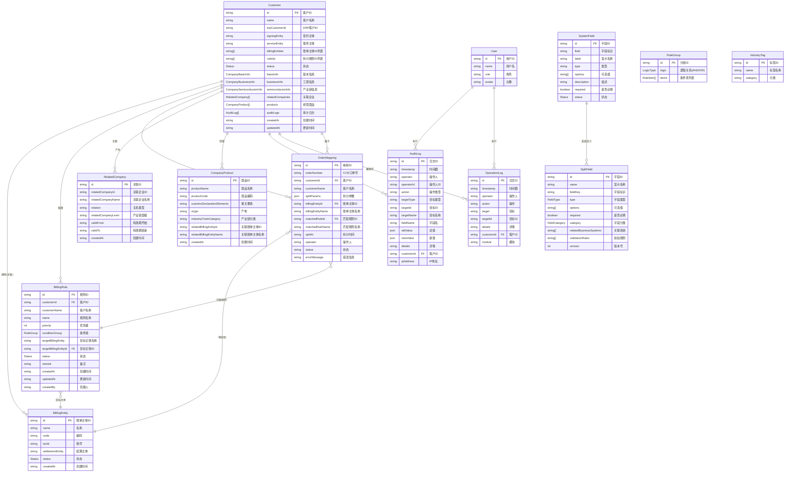

# CIM客户信息管理系统 - 数据模型ER图

## 实体关系图 (Mermaid)



## 实体说明

### 核心实体

#### 1. Customer (客户)
- **主键**: `id`
- **描述**: 系统的核心实体，存储客户的所有信息
- **关系**:
  - 拥有多个 BillingEntity
  - 配置多个 BillingRule
  - 产生多个 OrderMapping
  - 关联多个 RelatedCompany
  - 经营多个 CompanyProduct
  - 被审计日志记录

#### 2. BillingEntity (账单主体)
- **主键**: `id`
- **描述**: 账单拆分的目标主体，如FWD-8635等
- **关系**:
  - 被多个 BillingRule 指向
  - 被多个 OrderMapping 指向

#### 3. BillingRule (账单拆分规则)
- **主键**: `id`
- **描述**: 定义如何将订单拆分到不同账单主体的规则
- **关系**:
  - 属于一个 Customer
  - 指向一个 BillingEntity
  - 被多个 OrderMapping 匹配

#### 4. OrderMapping (订单映射)
- **主键**: `id`
- **描述**: 记录订单与账单主体的匹配结果
- **关系**:
  - 属于一个 Customer
  - 映射到一个 BillingEntity
  - 匹配一个 BillingRule

### 配置实体

#### 5. SplitField (拆分字段 - 客户级)
- **主键**: `id`
- **描述**: 客户自定义的拆分字段配置

#### 6. SystemField (系统字段 - 系统级)
- **主键**: `id`
- **描述**: 系统预定义的拆分字段模板
- **关系**: 被 SplitField 引用

### 业务实体

#### 7. RelatedCompany (关联企业)
- **主键**: `id`
- **描述**: 客户的上下游关联企业
- **关系**: 属于一个 Customer

#### 8. CompanyProduct (经营商品)
- **主键**: `id`
- **描述**: 客户经营的商品档案
- **关系**: 属于一个 Customer

#### 9. IndustryTag (行业标签)
- **主键**: `id`
- **描述**: 行业分类标签

### 日志与用户

#### 10. User (用户)
- **主键**: `id`
- **描述**: 系统用户
- **关系**: 执行多个 AuditLog 和 OperationLog

#### 11. AuditLog (审计日志)
- **主键**: `id`
- **描述**: 详细的字段级变更记录
- **关系**:
  - 属于一个 User
  - 属于一个 Customer

#### 12. OperationLog (操作日志)
- **主键**: `id`
- **描述**: 简化的操作记录
- **关系**:
  - 属于一个 User
  - 属于一个 Customer

## 枚举类型

### Status (状态)
- `active` - 激活
- `inactive` - 停用

### LogicType (逻辑类型)
- `AND` - 与
- `OR` - 或

### FieldType (字段类型)
- `text` - 文本
- `select` - 单选
- `multiselect` - 多选
- `date` - 日期
- `number` - 数字

### FieldCategory (字段分类)
- `all` - 全部
- `billing` - 账单
- `business` - 业务
- `semiconductor` - 半导体

### Operator (操作符)
- `equals` - 等于
- `not_equals` - 不等于
- `contains` - 包含
- `not_contains` - 不包含
- `in` - 在列表中
- `not_in` - 不在列表中
- `regex` - 正则匹配
- `any` - 任意值
- `empty` - 为空
- `not_empty` - 不为空

## 数据流向

```
COS订单录入
    ↓
传入拆分参数字段 (Plant, Location, 客户部门等)
    ↓
BillingRule 规则匹配 (按优先级)
    ↓
匹配成功 → OrderMapping 记录结果
    ↓
目标 BillingEntity
    ↓
CPQ 获取账单主体信息
```

## 关键业务流程

### 1. 账单拆分流程
```
1. COS 调用 CIM 获取字段配置
2. 用户在 COS 中输入字段值
3. COS 发送订单和字段值到 CIM
4. CIM 按优先级匹配 BillingRule
5. 返回匹配的 BillingEntity
6. 记录 OrderMapping
```

### 2. 规则配置流程
```
1. 选择客户
2. 创建/编辑 BillingRule
3. 设置优先级
4. 配置条件组 (支持嵌套 AND/OR)
5. 选择目标 BillingEntity
6. 保存并激活规则
```
