# CIM客户信息管理系统 - 系统架构图

## 业务架构图（简洁版）

```
┌─────────────────────────────────────────────────────────────────────────────────────────┐
│                                                                                           │
│  ┌──────────────────────────────────────────────────────────────┐  ┌──────────────┐ │
│  │              CIM客户信息管理系统                              │  │ 业务协同系统 │ │
│  ├──────────────────────────────────────────────────────────────┤  ├──────────────┤ │
│  │  ┌───────────────────────────────────────────────────────┐ │  │              │ │
│  │  │  客户管理                                              │ │  │ COS订单系统  │ │
│  │  │  企业基本信息 · 工商资质全景 · 产业链定位            │ │  │              │ │
│  │  │  上下游关联 · 经营商品档案 · 客户信息配置            │ │  │ CPQ报价系统  │ │
│  │  │  账单主体配置 · 操作日志                              │ │  │              │ │
│  │  └───────────────────────────────────────────────────────┘ │  │ 权限平台    │ │
│  │  ┌───────────────────────────────────────────────────────┐ │  │              │ │
│  │  │  账单主体规则管理                                      │ │  └──────────────┘ │
│  │  │  规则创建/编辑/删除 · 优先级排序                     │ │                     │
│  │  │  条件组配置 · AND/OR逻辑 · 账单主体选择 · 规则测试  │ │                     │
│  │  └───────────────────────────────────────────────────────┘ │                     │
│  │  ┌───────────────────────────────────────────────────────┐ │                     │
│  │  │  客户信息配置管理                                      │ │                     │
│  │  │  按客户分组配置 · 账单区分字段管理 · 字段名称配置   │ │                     │
│  │  │  字段类型配置 · 可选值管理 · 字段增删改 · 与规则同步  │ │                     │
│  │  │  字段分类管理                                      │ │                     │
│  │  └───────────────────────────────────────────────────────┘ │                     │
│  │  ┌───────────────────────────────────────────────────────┐ │                     │
│  │  │  系统管理                                              │ │                     │
│  │  │  字典管理 · 权限管理 · 接口管理 · 系统设置           │ │                     │
│  │  │  角色管理 · 用户管理 · 功能权限 · 数据权限           │ │                     │
│  │  └───────────────────────────────────────────────────────┘ │                     │
│  └──────────────────────────────────────────────────────────────┘                     │
│                                                                                           │
│  交互式查看：访问 /architecture-simple.html                                                │
│                                                                                           │
└─────────────────────────────────────────────────────────────────────────────────────────┘
```

---

## 技术架构图（完整版）

### 系统架构总览

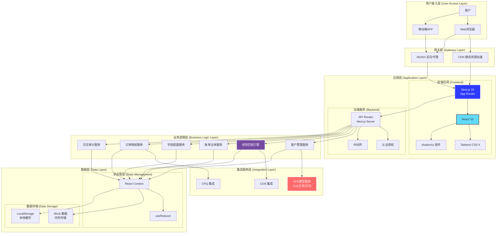

## 分层架构详解

### 1. 用户接入层 (User Access Layer)

| 组件 | 说明 |
|------|------|
| **用户** | 使用系统的各类角色（管理员、操作员、查看者） |
| **Web浏览器** | 主要访问方式，支持Chrome、Firefox、Safari等现代浏览器 |
| **移动端APP** | 预留移动端接入能力 |

### 2. 网关层 (Gateway Layer)

| 组件 | 说明 |
|------|------|
| **NGINX** | 反向代理服务器，负责请求转发、负载均衡、SSL终止 |
| **CDN** | 内容分发网络，加速静态资源（JS、CSS、图片）访问 |

### 3. 应用层 (Application Layer)

#### 前端应用 (Frontend)

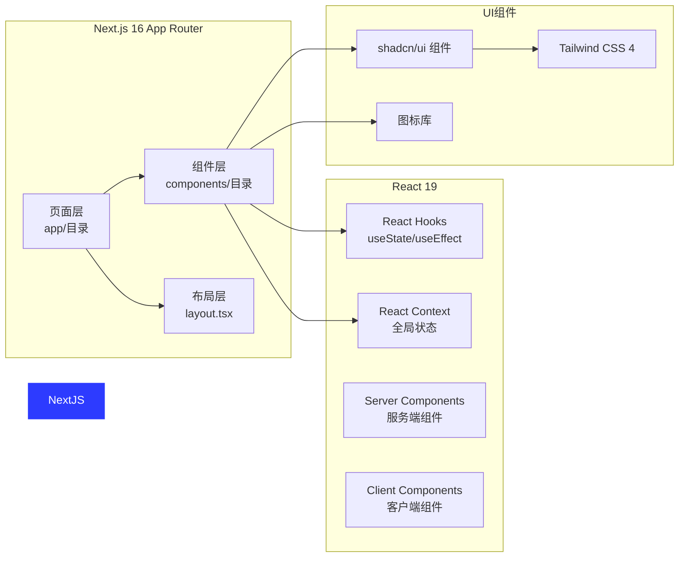

#### 后端服务 (Backend)

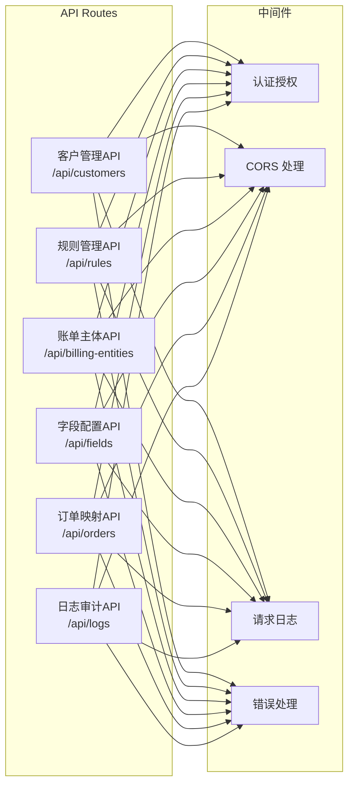

### 4. 业务逻辑层 (Business Logic Layer)

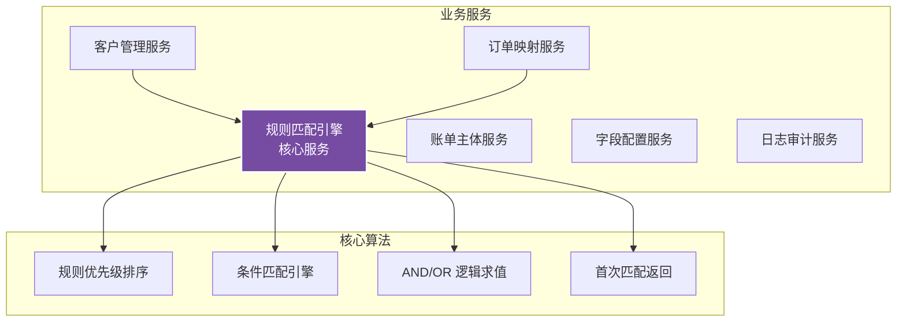

#### 规则匹配引擎工作流程

```mermaid
sequenceDiagram
    participant COS as COS订单系统
    participant CIM as CIM系统
    participant Rule as 规则匹配引擎
    participant DB as 数据存储

    COS->>CIM: 发送订单数据 (orderNumber, customerId, fields)
    CIM->>DB: 查询客户规则列表
    DB-->>CIM: 返回规则列表 (按优先级排序)
    CIM->>Rule: 开始规则匹配
    loop 按优先级遍历规则
        Rule->>Rule: 评估条件组 (AND/OR)
        alt 条件匹配成功
            Rule-->>CIM: 返回匹配的规则和账单主体
            break
        else 条件不匹配
            Rule->>Rule: 继续下一条规则
        end
    end
    alt 找到匹配规则
        CIM->>DB: 保存OrderMapping记录
        CIM-->>COS: 返回账单主体信息
    else 未找到匹配规则
        CIM-->>COS: 返回默认账单主体或错误
    end
```

### 5. 集成服务层 (Integration Layer)

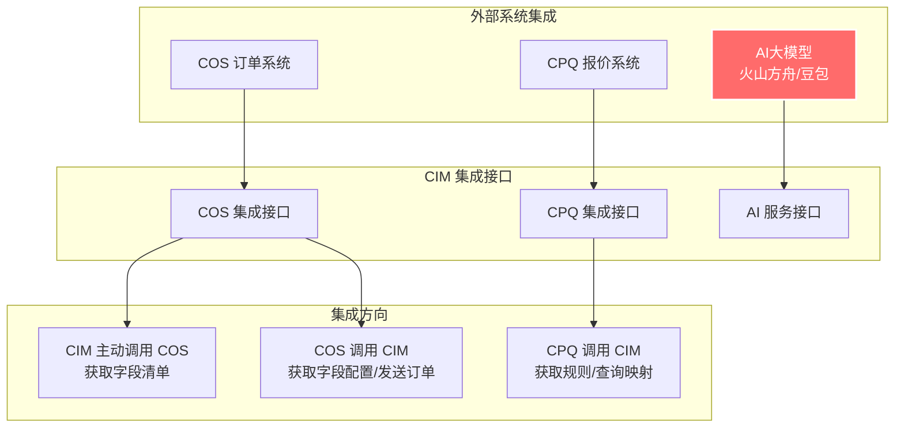

#### 系统交互时序图

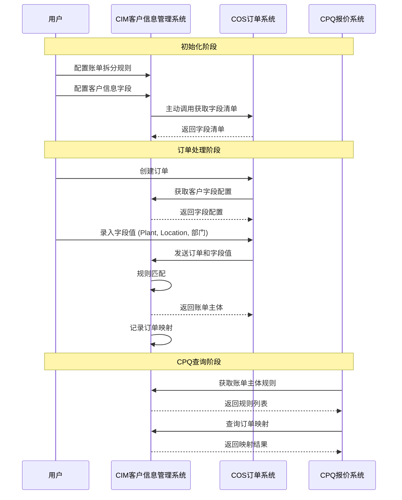

### 6. 数据层 (Data Layer)

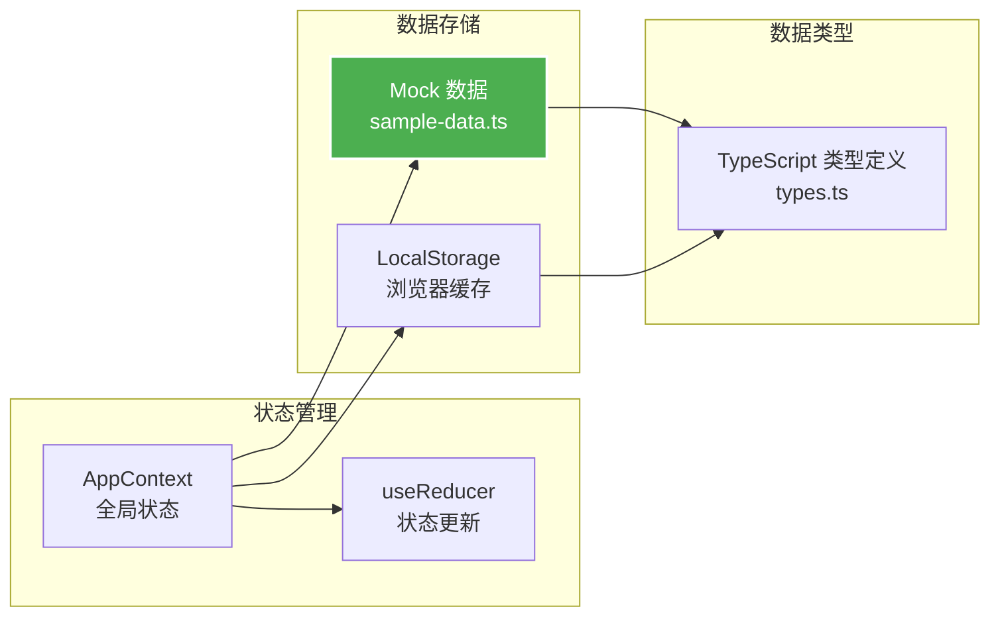

## 技术栈详解

### 前端技术栈

| 技术 | 版本 | 说明 |
|------|------|------|
| **Next.js** | 16 | React框架，App Router |
| **React** | 19 | UI库 |
| **TypeScript** | 5 | 类型安全 |
| **Tailwind CSS** | 4 | 原子化CSS |
| **shadcn/ui** | - | UI组件库 |

### 后端技术栈

| 技术 | 说明 |
|------|------|
| **Next.js API Routes** | 服务端API |
| **Node.js** | 运行环境 |
| **React Context + useReducer** | 状态管理 |

### 开发工具

| 工具 | 说明 |
|------|------|
| **pnpm** | 包管理器 |
| **coze CLI** | 项目管理 |
| **ESLint** | 代码检查 |
| **TypeScript Compiler** | 类型检查 |

## 部署架构

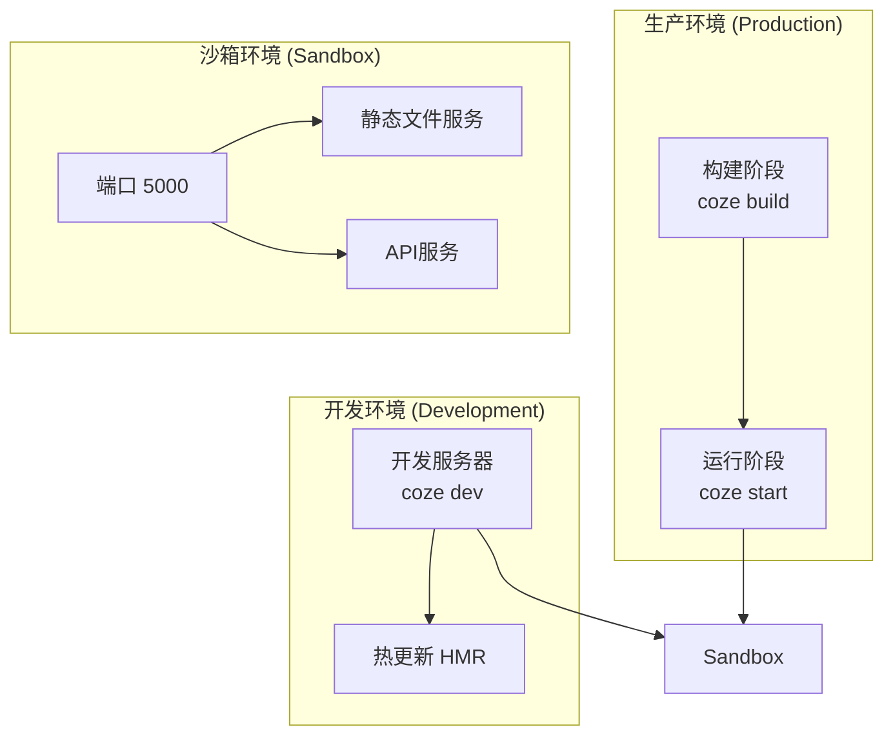

## 目录结构架构

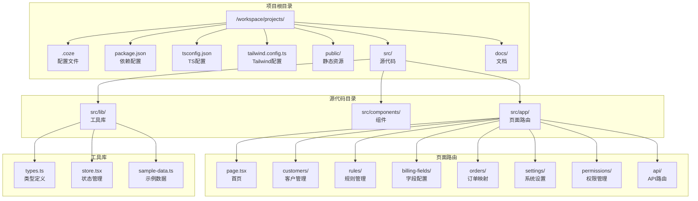

## 安全架构

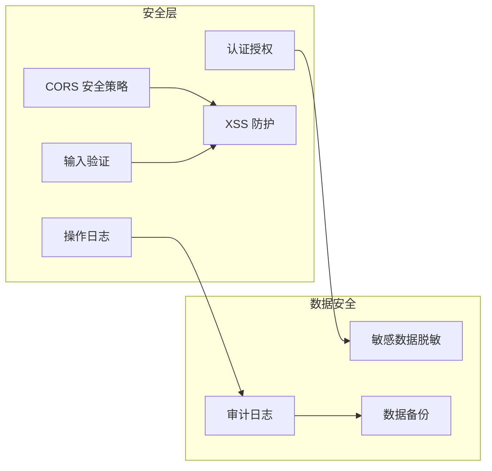

## 性能优化策略

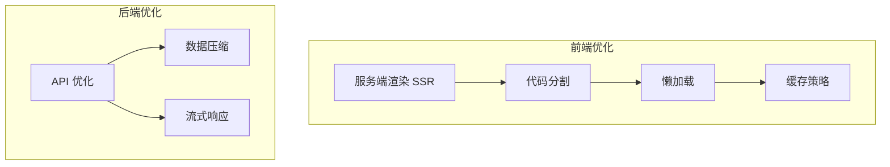

## 扩展架构

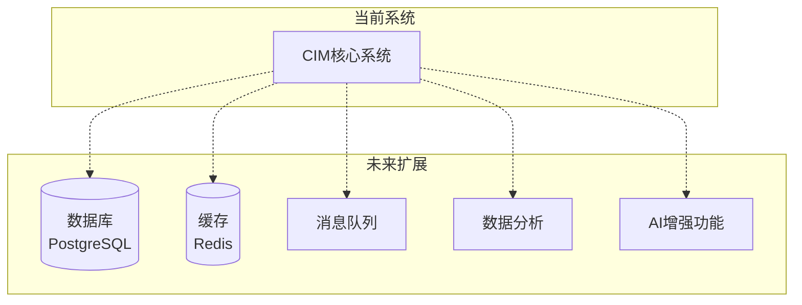

---

**文档版本**: v1.0  
**最后更新**: 2026-04-23  
**系统名称**: CIM客户信息管理系统
