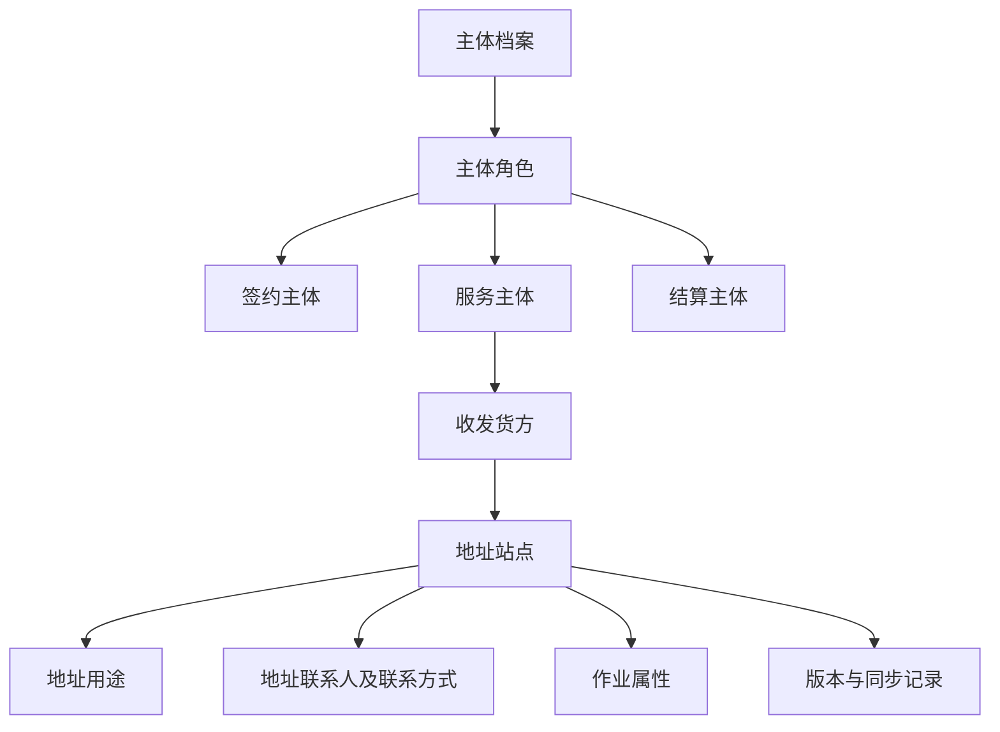
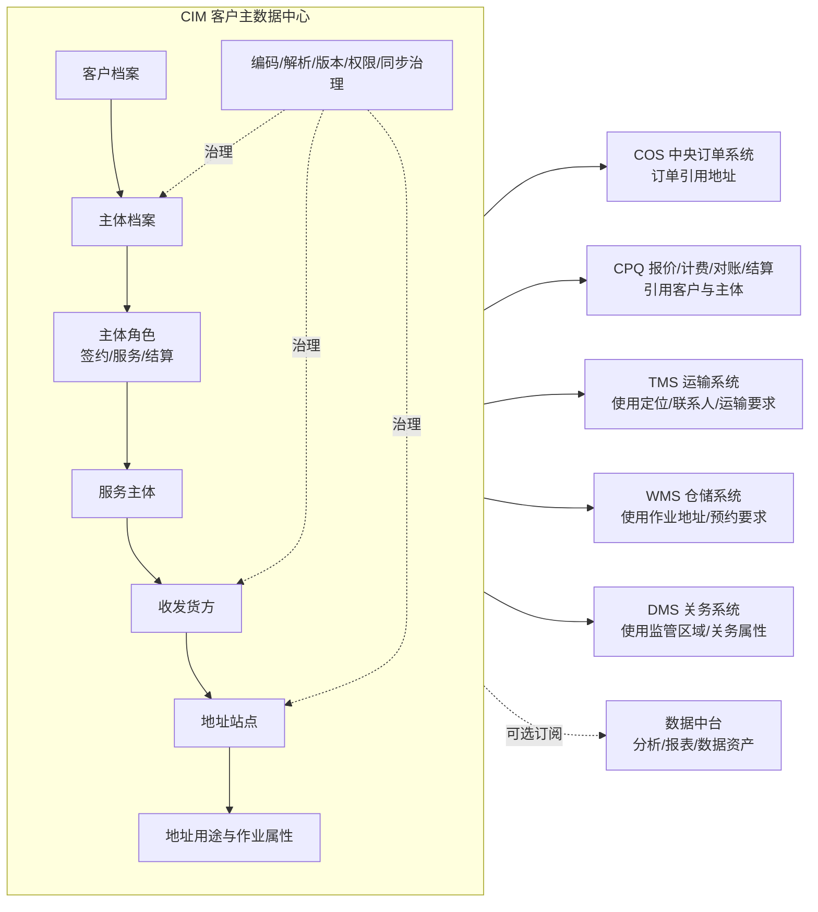
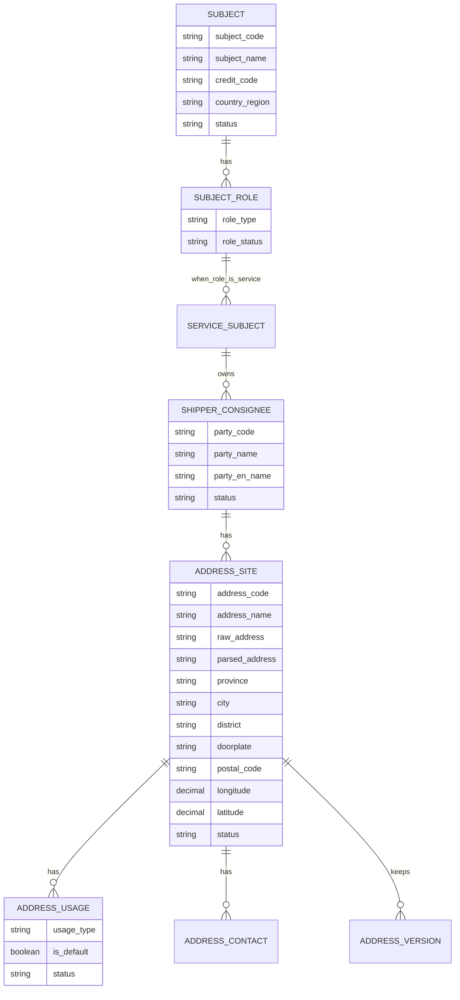
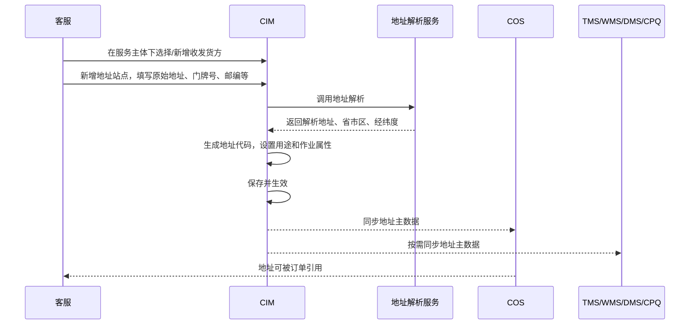
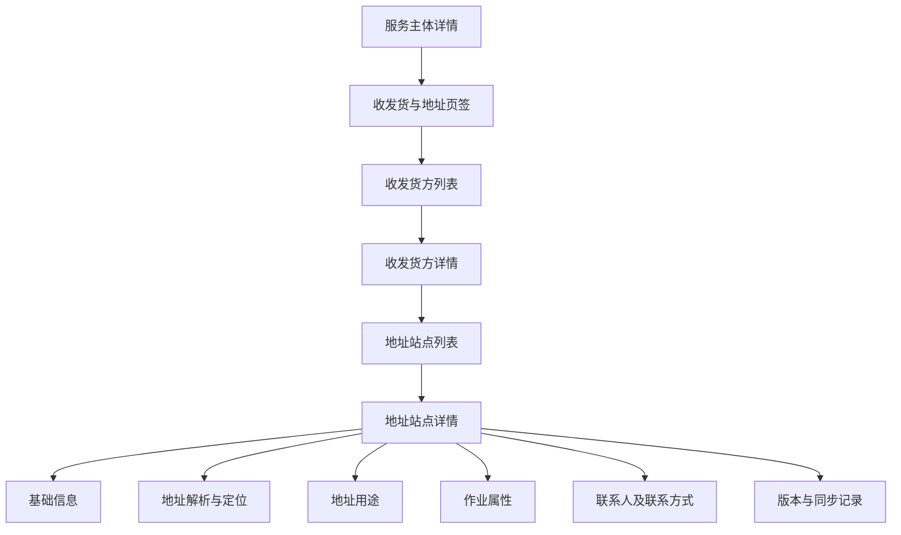

# 客户主数据升级设计思想与整体逻辑

> 适用对象：CIM、COS、CPQ、TMS、WMS、DMS、数据中台相关产品、研发、业务、客服、订单、关务、仓储、运输团队  
> 适用背景：半导体行业全链路供应链服务公司，覆盖关务、仓储、运输、报价计费、订单履约、结算对账等业务场景  
> 文档目的：说明为什么要做客户主数据升级、主数据应如何建模、地址主数据如何纳入CIM，以及各业务系统之间应如何分工协同。

---

## 1. 一句话概括本次升级

本次主数据升级的核心，不是简单把COS里的地址维护页面搬到CIM，而是要把CIM建设成客户主数据的源头系统：以“客户/主体”为核心，统一管理主体身份、主体角色、服务关系、收发货方、地址站点、地址用途及相关业务属性，再将经过治理的主数据同步给COS、CPQ、TMS、WMS、DMS等业务系统使用。

也就是说，CIM未来不只是客服查看客户信息的系统，而应成为公司客户主数据的“准入、维护、治理、分发中心”。

---

## 2. 为什么现在需要升级

### 2.1 当前问题

目前公司已经在COS中有地址主数据管理能力，但整体仍偏向订单作业辅助，而不是完整的客户主数据管理。典型问题包括：

1. 客户、收发货方、地址等信息在页面和数据结构上耦合较重，边界不够清晰。
2. 地址维护发生在COS，但实际掌握客户地址变化的是客服团队。
3. 客服不使用COS，只能通过邮件通知订单组新增或修改地址，形成线下传递。
4. 订单组既要做订单，又要代替客服维护地址，职责不够清晰。
5. 地址变更、停用、历史版本、下游同步状态缺少系统化治理。
6. 客户主体、服务主体、收发货方、地址用途之间的层级关系没有被完整表达。
7. 后续如果主体管理也要放入CIM，现有COS地址模式难以承接更完整的客户主数据治理目标。

### 2.2 升级后的目标

升级后的目标是：

1. 让CIM成为客户主数据源头系统。
2. 让客服在CIM维护客户主数据和地址主数据。
3. 让COS从“维护地址”转为“引用地址、使用地址”。
4. 让订单组在COS下单时选择已生效、已同步的地址，而不是依赖邮件去录入。
5. 让TMS、WMS、DMS、CPQ按业务需要使用同一套客户主数据，减少重复录入和口径不一致。
6. 让地址主数据从单纯的文本地址升级为支持运输、仓储、关务、订单、计费等全链路业务的结构化主数据。

---

## 3. 主数据升级的核心思想

### 3.1 从“业务系统各自维护”升级为“源头统一治理”

原模式下，COS、CPQ、TMS、WMS、DMS等系统可能各自沉淀客户相关信息。每个系统都能记录一点，但没有一个明确的源头。

升级后的思路是：

- CIM负责客户主数据的创建、补全、维护、治理和分发。
- COS负责订单执行，不再作为客户地址主数据的源头。
- CPQ负责报价、计费、对账、结算相关业务，不反向主导客户基础资料。
- TMS负责运输执行，使用地址的定位、联系人、装卸要求、车辆限制等信息。
- WMS负责仓储执行，使用仓库作业相关地址、联系人、预约和作业要求等信息。
- DMS负责关务执行，使用收发货方、境内外主体、监管区域、海关相关属性等信息。
- 数据中台尽量不参与业务主链路，可用于分析和报表订阅，不作为业务系统之间的实时中转。

这背后的思想是：主数据先治理，再使用；业务系统只消费自己需要的部分，不再各自改一份。

### 3.2 从“地址文本”升级为“地址主数据对象”

过去地址经常被理解为一段文本，例如“某省某市某区某路某号”。但在供应链业务里，地址不是普通文本，而是会影响运输、仓储、关务、订单履约和计费的关键业务对象。

所以地址主数据至少要表达：

- 地址属于哪个服务主体；
- 地址对应哪个收发货方；
- 地址站点在哪里；
- 地址可以用于什么业务场景；
- 地址是否可用于收货、发货、提货、送货、退货、报关、仓储作业等；
- 地址是否在海关特殊监管区域；
- 地址有哪些联系人和联系方式；
- 地址有哪些运输、仓储、关务特殊要求；
- 地址解析是否成功，经纬度是否可靠；
- 地址是否启用，是否已同步到下游系统；
- 地址变更后历史订单如何保留快照。

因此，本次升级不是“补几个字段”，而是把地址从订单系统里的附属字段，升级为客户主数据体系中的独立治理对象。

### 3.3 从“公共地址池”改为“客户私域地址库”

地址主数据不建议做成全公司公共地址池。

原因是：

1. 不同客户之间的地址、收发货方、联系人及联系方式可能涉及商业隐私。
2. 不同客户即使文字地址相同，业务关系、联系人、用途、特殊要求也可能完全不同。
3. 半导体供应链服务中，客户、供应商、厂区、仓库、报关主体等关系敏感，不适合让不同客户共享一个可见地址池。
4. 实际业务中，不同公司完全共用同一套地址主数据的场景并不高频。

所以更合理的设计是：每个服务主体拥有自己的收发货方和地址站点，形成服务主体下的私域地址库。

如果后续确实遇到相同地址复用的需求，可以提供“复制地址”能力。复制后生成新的地址站点记录，归属于新的服务主体，后续独立维护，不自动联动。

### 3.4 从“一张大表单”升级为“分层模型”

现有COS地址页面把客户信息、收发货方信息、地址信息放在同一个编辑页面中，适合快速录入，但不适合作为长期主数据模型。

未来CIM中应拆成清晰的层级：

核心模型为：

> 各主体 → 主体角色 → 服务主体 → 收发货方 → 地址站点 → 地址用途

其中，只有服务主体继续向下挂接收发货方和地址站点。签约主体、结算主体本身不直接维护收发货地址，除非它同时也是服务主体。

---

## 4. 目标架构

### 4.1 整体架构定位

目标架构中，CIM位于客户主数据中心位置，负责统一管理客户、主体、收发货方和地址等主数据，并直接向各业务系统分发。

### 4.2 系统职责边界

| 系统 | 目标职责 | 不建议承担的职责 |
|---|---|---|
| CIM | 客户主数据源头；主体、角色、收发货方、地址站点、地址用途维护；编码、解析、版本、同步治理 | 不直接承担订单履约、报价计费、运输调度、仓储作业、报关执行 |
| COS | 中央订单系统；下单时引用CIM已生效地址；保留订单地址快照 | 不再作为地址主数据源头；不承担客服侧地址维护 |
| CPQ | 报价、计费、对账、结算；使用客户、签约主体、结算主体、服务主体信息 | 不主导客户基础档案治理 |
| TMS | 运输执行；使用地址定位、联系人、运输要求、装卸限制 | 不维护客户地址源头 |
| WMS | 仓储执行；使用仓储作业地址、预约要求、收发货联系人 | 不维护客户地址源头 |
| DMS | 关务执行；使用收发货方、监管区域、境内外主体、关务属性 | 不维护客户地址源头 |
| 数据中台 | 数据分析、报表、主题建模、指标加工 | 不作为主数据业务链路的中转；不反向修改CIM主数据 |

---

## 5. 客户主数据范围设计

客户主数据不应只包括客户名称和地址。对于半导体供应链服务公司，客户主数据建议分为以下几类。

### 5.1 客户与主体类

这一类是客户主数据的根。

核心内容包括：

- 客户名称；
- 客户简称；
- 客户英文名；
- 客户类型；
- 客户状态；
- 统一社会信用代码；
- 法人/公司注册信息；
- 国家/地区；
- 注册地址；
- 营业地址；
- 客户归属销售/客服；
- 客户生命周期状态；
- 客户来源；
- 客户行业；
- 客户分级；
- 客户标签。

主体管理要支持同一法律实体只保留一条主体记录，通过角色标签表达其不同业务身份：

- 签约主体；
- 服务主体；
- 结算主体。

如果一个主体既是签约主体又是服务主体，也不应建两条主体，而应在同一主体记录上挂多个角色。

### 5.2 服务关系类

这一类表达“公司为哪个主体提供什么服务”。

核心内容包括：

- 服务主体；
- 服务范围；
- 服务产品；
- 服务线路；
- 业务类型；
- 是否涉及关务；
- 是否涉及仓储；
- 是否涉及运输；
- 是否涉及保税/监管区域；
- 客户服务团队；
- 客服负责人；
- 订单负责人；
- 业务启用状态。

服务主体是地址主数据继续向下展开的关键节点。

### 5.3 收发货方类

收发货方不是地址，也不是客户本身，而是服务主体下的业务对象。它可能是客户自己的工厂、供应商、收货方、发货方、终端客户、维修点、退货点等。这里使用“收发货方”，是为了避免“人”被误解为自然人；实际业务中它可以是公司、工厂、仓库、供应商、客户指定地点等组织或场所主体。

核心内容包括：

- 收发货方代码；
- 收发货方名称；
- 收发货方英文名称；
- 所属服务主体；
- 收发货方类型；
- 是否境内/境外；
- 国家/地区；
- 联系人；
- 联系方式；
- 状态；
- 备注。

收发货方下面可以有多个地址站点。

### 5.4 地址站点类

地址站点是本次升级的重点。地址站点表示一个可被订单、运输、仓储、关务业务引用的具体地点。

核心内容包括：

- 地址站点代码；
- 地址站点名称；
- 所属服务主体；
- 所属收发货方；
- 国家/地区；
- 原始详细地址；
- 解析地址；
- 省；
- 市；
- 区/县；
- 街道/乡镇；
- 门牌号；
- 邮政编码；
- 经度；
- 纬度；
- 解析状态；
- 地址状态；
- 是否默认地址；
- 生效日期；
- 失效日期；
- 停用原因。

其中，省、市、区县、解析地址、经度、纬度应由地址解析能力带出，不建议人工手改。若解析错误，应修改原始详细地址后重新解析。

门牌号和邮政编码可以人工录入。

### 5.5 地址用途类

同一个地址可以用于多个业务场景，所以“收货地址”和“发货地址”不应拆成两个地址库，而应通过地址用途表达。

建议支持的地址用途包括：

- 收货；
- 发货；
- 提货；
- 送货；
- 退货；
- 报关；
- 仓储作业；
- 计费/结算相关地址；
- 其他业务用途。

一个地址站点可以挂多个用途。例如同一个工厂地址既可以是收货地址，也可以是发货地址，还可能用于报关或退货。

### 5.6 作业属性类

供应链业务中，地址能不能用，往往不仅取决于地址本身，还取决于现场作业要求。

建议沉淀的作业属性包括：

- 是否在海关特殊监管区域内；
- 监管区域名称；
- 是否综保区卡口内；
- 是否需要预约；
- 可作业时间；
- 节假日是否可作业；
- 是否允许大车进入；
- 是否有月台；
- 是否需要叉车；
- 是否需要尾板车；
- 是否需要司机身份证；
- 是否需要车辆备案；
- 是否需要报关资料；
- 是否有仓库特殊要求；
- 是否有运输特殊要求；
- 特殊要求说明。

这些字段不是所有场景首期都必须做完，但建议在模型上预留扩展能力。

### 5.7 联系人与权限类

联系人及联系方式信息既可能属于客户主体，也可能属于收发货方或地址站点。

建议区分：

- 客户联系人及联系方式；
- 商务联系人及联系方式；
- 财务联系人及联系方式；
- 订单联系人及联系方式；
- 收发货联系人及联系方式；
- 地址现场联系人及联系方式；
- 关务联系人及联系方式；
- 仓储联系人及联系方式；
- 运输联系人及联系方式。

不同联系人及联系方式可设置不同用途，避免一个“联系人/联系方式”字段承担所有业务含义。

### 5.8 风控、财务、合同、资质类

这些也是客户主数据的重要组成部分，但不一定都由地址项目首期实现。

建议纳入客户主数据范围的内容包括：

- 风控等级；
- 黑白名单状态；
- 授信信息；
- 账期；
- 结算币种；
- 开票信息；
- 税号；
- 银行账户；
- 合同信息；
- 业务资质；
- 报关资质；
- 授权文件；
- 附件资料。

这一类信息敏感度高，需有更严格的权限控制。

---

## 6. 地址主数据详细设计逻辑

### 6.1 地址模型

目标模型为：

### 6.2 为什么是这个层级

这个层级解决了几个关键问题：

1. 主体角色清晰  
   同一个法律实体可以同时是签约主体、服务主体、结算主体，不重复建档。

2. 服务主体是业务履约入口  
   只有服务主体才需要继续维护收发货方、地址站点和地址用途。

3. 收发货方和地址分离  
   同一个收发货方可以有多个地址，例如总部、工厂、仓库、维修点、退货点。

4. 地址和用途分离  
   同一个地址可以用于多个业务场景，不需要重复建多个“收货地址/发货地址”。

5. 地址站点可以独立治理  
   地址可以解析、停用、同步、版本管理、记录作业要求。

### 6.3 地址新增流程

建议目标流程如下：

当前已确认：地址新增、修改、删除暂不审批。  
但建议CIM预留审批开关，后续如果领导确认需要审批，可以配置为：

- 普通地址新增/修改：客服提交，客服主管审批；
- 涉及关务敏感字段：关务团队会签；
- 涉及仓储作业字段：仓储团队会签；
- 涉及运输限制字段：运输团队会签。

### 6.4 地址修改流程

地址修改需要区分两类：

1. 修正类修改  
   例如联系人、联系电话、门牌号、邮编、特殊要求等补充或修正。

2. 实质地址变更  
   例如从A地点改到B地点，省市区、经纬度、解析地址发生变化。

建议规则：

- 如果只是小字段修正，可以在原地址站点上更新，并记录版本。
- 如果实际地点发生变化，原则上应新建地址站点或生成新版本，避免历史订单地址被覆盖。
- 已完成订单保留当时地址快照。
- 未完成订单是否允许自动更新地址，需要业务确认。建议默认不自动更新，只提示订单组评估。

### 6.5 地址停用流程

地址不建议物理删除，应采用停用。

停用规则建议：

- 已被订单引用的地址不允许物理删除。
- 停用后COS下单不可再选择。
- 停用前检查是否存在未完成订单。
- 如存在未完成订单，应提示并限制，或要求指定替代地址。
- 停用原因必须填写。
- 停用记录同步到COS、TMS、WMS、DMS等相关系统。

---

## 7. 地址字段设计要点

### 7.1 从现有COS字段到CIM目标字段的理解

现有COS页面中包含以下几类字段：

1. 客户信息  
   客户名称、客户地址代码、客户地址名称、客户详细地址、客户英文地址。

2. 收发货方信息  
   收发货方名称、客户收发货方代码、客户收发货方名称、客户收发货方英文名称。

3. 地址信息  
   地址类型、地区、省份、城市、县区、解析地址、门牌号、邮编、经度、纬度、联系人、联系方式、是否在海关特殊监管区域内、特殊要求。

目标CIM设计中，不应继续把这些字段混在同一层。但这里需要注意一个重要原则：

> 首期不建议直接变更COS现有字段名称、页面结构和订单作业习惯。CIM内部可以按新的主数据模型治理，COS侧先保持原字段和原使用方式，通过字段映射接收CIM同步数据。

这样做的好处是：

1. 降低上线阻力，避免被质疑“为什么订单系统也要跟着大改”。
2. 保持订单组当前作业习惯，减少培训和切换成本。
3. 让本次升级的重点聚焦在“CIM成为源头、COS引用数据”，而不是陷入COS页面字段命名争议。
4. 为后续COS优化留下空间，等主数据源头稳定后，再逐步评估COS页面是否需要改造。

因此，下表表达的是“CIM目标模型与COS现有字段之间的逻辑映射”，不是要求COS首期立即改字段。

| COS现有概念 | CIM目标对象 | 设计说明 |
|---|---|---|
| 客户名称 | 服务主体 | COS字段首期保持不变；CIM侧从主体档案带出并同步给COS |
| 客户地址代码 | 地址站点代码/旧系统映射码 | COS可继续展示原字段；CIM生成新地址站点代码，同时保留COS旧代码映射 |
| 客户地址名称 | 地址站点名称 | COS字段名首期不变；CIM内部理解为地址站点名称 |
| 客户详细地址 | 原始详细地址 | COS字段首期不变；CIM侧作为地址解析的输入 |
| 客户英文地址 | 地址英文名称/英文地址 | COS字段首期不变；CIM侧用于境外、关务、单证场景 |
| 收发货方代码 | 收发货方代码/旧系统映射码 | COS字段首期不变；CIM生成收发货方代码并保留旧代码映射 |
| 收发货方名称 | 收发货方名称 | COS字段首期不变；CIM内部作为服务主体下的收发货方档案 |
| 地址类型 | 地址用途映射 | COS字段首期保持现状；CIM内部用地址用途表达收货、发货、提货、送货等 |
| 省市区 | 解析结果 | COS字段首期不变；CIM侧由解析服务带出，不允许手改 |
| 解析地址 | 标准化地址 | COS字段首期不变；CIM侧由解析服务带出，不允许手改 |
| 门牌号 | 门牌号 | COS字段首期不变；CIM侧手工录入 |
| 邮政编码 | 邮政编码 | COS字段首期不变；CIM侧手工录入 |
| 经度/纬度 | 地址坐标 | COS字段首期不变；CIM侧由解析服务带出，不允许手改 |
| 联系人/联系方式 | 地址联系人及联系方式 | COS字段首期不变；CIM侧可扩展多联系人、多联系方式和联系人用途 |
| 是否在海关特殊监管区域 | 关务/监管属性 | COS字段首期不变；CIM侧作为地址作业属性之一 |
| 特殊要求 | 作业要求说明 | COS字段首期不变；CIM侧先承接文本，后续再评估结构化 |

首期对COS更合适的口径是：

- COS字段不改名；
- COS页面不做大改；
- COS下单逻辑尽量保持；
- COS地址数据来源从“COS本地维护”逐步切到“CIM同步”；
- COS保留现有字段展示和使用，底层通过映射接收CIM主数据。

### 7.2 地址解析规则

当前已确认的规则：

- 省、市、区县、解析地址由地址解析带出。
- 经度、纬度由地址解析带出。
- 门牌号和邮政编码手工录入。
- 解析结果目前不允许人工修改。
- 若解析结果错误，应修改原始详细地址后重新解析。

建议在CIM中增加：

- 解析状态：未解析、解析成功、解析失败、需人工确认；
- 解析时间；
- 解析服务来源；
- 解析失败原因；
- 最近一次解析人；
- 最近一次解析时间。

### 7.3 编码规则

建议由CIM统一生成以下编码：

- 服务主体代码；
- 收发货方代码；
- 地址站点代码。

COS旧代码保留为迁移映射字段，不建议继续作为新主数据的主键。

这样可以避免历史系统代码规则限制未来主数据模型，也便于后续CIM成为真正源头。

---

## 8. 关键业务流程设计

### 8.1 客服维护地址，订单组使用地址

目标业务分工应调整为：

| 角色 | 当前模式 | 目标模式 |
|---|---|---|
| 客服 | 知道客户地址变化，通过邮件通知订单组 | 在CIM维护收发货方和地址主数据 |
| 订单组 | 收邮件后在COS新增/修改地址，再做订单 | 在COS下单时选择CIM同步过来的有效地址 |
| 运输团队 | 订单执行中使用地址 | 使用CIM同步到TMS的定位、联系人、运输要求 |
| 仓储团队 | 作业中使用地址或现场要求 | 使用CIM同步到WMS的作业地址和要求 |
| 关务团队 | 报关时判断监管区域等 | 使用CIM同步到DMS的关务相关地址属性 |

目标不是让所有人都去CIM改数据，而是让“知道源头信息的人维护，业务执行系统引用”。

### 8.2 COS下单使用地址

COS下单时建议逻辑：

1. 订单选择客户/服务主体。
2. COS根据服务主体查询可用收发货方。
3. 订单选择收发货方。
4. COS查询该收发货方下已生效地址站点。
5. 订单选择地址用途符合要求的地址。
6. 下单时保存地址快照。
7. 后续CIM地址变更不自动覆盖已完成订单。

### 8.3 地址同步逻辑

建议CIM直接同步到业务系统，不通过数据中台作为业务中转。

同步策略：

- 新增地址：同步新增；
- 修改地址：同步变更，并记录版本；
- 停用地址：同步停用状态；
- 删除地址：原则上不物理删除，只同步停用；
- 同步失败：CIM中显示失败状态，支持重试；
- 下游系统不可反向修改CIM地址主数据。

### 8.4 数据中台定位

数据中台可以接收CIM主数据，用于：

- 客户主数据分析；
- 客户画像；
- 数据质量监控；
- 主数据资产目录；
- 报表和指标。

但当前阶段不建议让数据中台参与CIM到COS/TMS/WMS/DMS/CPQ的业务主链路。这样可以减少链路复杂度和责任不清。

---

## 9. 权限与治理设计

### 9.1 权限原则

建议按“谁维护、谁查看、谁使用”区分权限。

| 权限类型 | 说明 |
|---|---|
| 查看权限 | 谁可以查看客户、主体、收发货方、地址 |
| 新增权限 | 谁可以新增收发货方和地址 |
| 修改权限 | 谁可以修改地址字段 |
| 停用权限 | 谁可以停用地址 |
| 敏感字段权限 | 谁可以查看/维护财务、风控、关务资质等敏感信息 |
| 同步管理权限 | 谁可以查看同步状态、手动重试同步 |

### 9.2 客户私域隔离

地址主数据应按服务主体隔离。

原则：

- A服务主体下的地址，B服务主体不可见、不可直接引用。
- 不提供全公司公共地址池给普通业务用户搜索。
- 如需复用地址，通过“复制地址”生成B服务主体下的新地址记录。
- 复制后的地址与原地址没有自动联动关系。

### 9.3 审批策略

当前已确认：地址增删改查目前不审批。

但建议在设计上保留审批能力，作为配置项：

- 审批关闭：保存即生效，同步下游。
- 审批开启：提交后待审批，审批通过后生效并同步。
- 特殊字段可配置会签，例如监管区域、运输限制、仓储作业要求等。

需要后续向领导确认的问题：

- 地址新增是否需要审批；
- 地址修改是否需要审批；
- 地址停用是否需要审批；
- 哪些字段属于敏感字段；
- 哪些角色拥有停用权限。

---

## 10. 数据质量与版本管理

### 10.1 数据质量规则

建议设置以下质量规则：

- 服务主体必填；
- 收发货方必填；
- 地址站点名称必填；
- 原始详细地址必填；
- 地址用途至少选择一个；
- 国内地址必须解析出省、市、区县；
- 经纬度必须来自解析服务；
- 停用必须填写原因；
- 同一服务主体、同一收发货方下，疑似重复地址应提示；
- 地址联系人及联系方式建议至少填写一组；
- 涉及运输/仓储/关务用途时，相关作业属性应补充完整。

### 10.2 重复地址处理

不建议跨客户自动合并地址。

建议只在同一服务主体、同一收发货方下做重复提醒：

- 原始地址高度相似；
- 解析地址一致；
- 经纬度接近；
- 地址站点名称相似。

系统提示疑似重复，由客服判断是否继续新增。

### 10.3 版本与审计

地址主数据必须保留操作痕迹。

建议记录：

- 创建人；
- 创建时间；
- 修改人；
- 修改时间；
- 修改前内容；
- 修改后内容；
- 修改原因；
- 停用人；
- 停用时间；
- 停用原因；
- 同步记录；
- 下游系统接收状态。

这对后续问题追溯非常关键，尤其是订单地址错误、运输送错地点、关务资料异常等场景。

---

## 11. 页面与产品设计思路

### 11.1 CIM中建议新增的页面入口

建议在服务主体详情中增加“收发货与地址”页签。

页面层级：

### 11.2 不建议继续使用超长弹窗

现有COS页面是超长编辑弹窗，适合作为作业录入页面，但不适合作为CIM主数据维护页面。

建议CIM采用详情页或抽屉式分区设计：

1. 基础信息  
   地址站点名称、所属服务主体、所属收发货方、地址状态等。

2. 地址定位  
   国家/地区、原始详细地址、解析地址、省市区、门牌号、邮编、经纬度、解析状态。

3. 地址用途  
   收货、发货、提货、送货、退货、报关、仓储作业等。

4. 作业属性  
   运输、仓储、关务相关要求。

5. 联系人及联系方式  
   现场联系人、电话、邮箱、联系人用途、联系方式用途。

6. 版本与同步  
   修改记录、停用记录、同步状态、同步失败原因。

---

## 12. 迁移思路

### 12.1 迁移原则

本次迁移建议采用“统一迁移、CIM成为源头”的方式。

原则包括：

- COS现有服务主体、收发货方、地址数据迁移到CIM；
- CIM生成新的主数据编码；
- COS旧代码保留为历史映射；
- 迁移后原则上不再在COS维护地址主数据；
- COS只引用CIM同步过来的地址；
- 迁移前要做数据清洗和重复识别；
- 迁移后要有新旧代码映射表和回滚预案。

### 12.2 迁移映射

迁移时建议按以下对象拆分：

| COS现有数据 | CIM目标对象 |
|---|---|
| 客户名称 | 服务主体 |
| 收发货方代码/名称 | 收发货方 |
| 客户地址代码/名称 | 地址站点 |
| 地址类型 | 地址用途 |
| 省市区/解析地址/经纬度 | 地址解析结果 |
| 联系人/联系方式 | 地址联系人及联系方式 |
| 特殊监管区域 | 地址关务属性 |
| 特殊要求 | 地址作业要求 |

### 12.3 迁移后的系统切换

建议分阶段切换：

1. 数据盘点  
   用Excel清单核对现有字段、缺失字段、字段归属系统。

2. 数据清洗  
   清理重复收发货方、重复地址、无效地址、解析失败地址。

3. 初始化迁移  
   将COS现有地址导入CIM，生成CIM主数据编码。

4. 双写/灰度观察  
   可短期保留COS只读或受控维护能力，验证同步稳定性。

5. 正式切源  
   CIM成为唯一维护入口，COS仅引用。

6. 后续优化  
   引入审批、质量评分、更多作业属性、数据中台分析。

---

## 13. 重点注意事项

### 13.1 不要把地址主数据做成公共池

这是本次设计中的重要原则。公共地址池看起来能复用，但会带来隐私、权限、业务归属和维护责任问题。客户私域地址库更符合实际业务。

### 13.2 不要把收货地址和发货地址拆成两个库

收货、发货只是地址用途，不是两个不同地址对象。应统一为地址站点，通过用途标签区分。

### 13.3 不要让数据中台成为业务主链路中转

数据中台适合分析，不适合承担业务系统之间的实时主数据分发责任。当前阶段CIM应直接同步业务系统。

### 13.4 不要让COS继续承担源头维护

如果迁移后COS仍然允许自由新增和修改地址，主数据源头就会再次分裂。建议迁移后COS只引用CIM地址。

### 13.5 不要覆盖历史订单地址

订单使用地址时应保存地址快照。地址主数据后续修改，不应影响已完成订单的历史事实。

### 13.6 地址审批目前不启用，但要预留能力

当前业务确认地址增删改查不用审批，但这个问题需要后续和领导确认。系统设计应保留审批配置能力，避免未来推倒重做。

### 13.7 地址解析结果不手改

省、市、区、解析地址、经纬度由解析服务带出，不允许人工直接修改。解析错误时通过修改原始地址重新解析。

---

## 14. 建议分期建设路线

### 14.1 第一期：地址主数据基础能力

目标：先把COS地址维护能力迁入CIM，并建立正确模型。

范围：

- 服务主体下维护收发货方；
- 收发货方下维护地址站点；
- 地址用途管理；
- 地址解析；
- 经纬度带出；
- 门牌号、邮编手工录入；
- 地址联系人及联系方式；
- 特殊监管区域；
- 特殊要求；
- CIM生成编码；
- 同步COS；
- COS下单引用地址；
- 地址版本和操作日志。

### 14.2 第二期：全链路业务属性增强

目标：让地址更好支撑运输、仓储、关务。

范围：

- 运输限制字段；
- 仓储作业字段；
- 关务监管字段；
- 多联系人、多联系方式；
- 地址质量评分；
- 重复地址提醒；
- 同步失败重试；
- TMS/WMS/DMS按需消费地址。

### 14.3 第三期：客户主数据完整治理

目标：CIM成为完整客户主数据源头。

范围：

- 主体管理完善；
- 签约/服务/结算角色统一；
- 风控信息；
- 财务结算信息；
- 开票信息；
- 合同和资质；
- 附件资料；
- 审批工作流配置；
- 数据中台分析订阅。

---

## 15. 最终目标状态

最终希望形成的状态是：

1. 客服在CIM维护客户、主体、收发货方和地址。
2. CIM统一生成主数据编码。
3. 地址经过解析、校验、版本记录后生效。
4. COS下单时只选择CIM同步来的有效地址。
5. TMS、WMS、DMS、CPQ按各自业务需要消费CIM主数据。
6. 数据中台只做分析订阅，不参与业务主链路。
7. 客户主数据有明确源头、明确责任人、明确权限、明确变更记录。
8. 地址不再是订单系统里的附属字段，而是支撑全链路供应链服务的重要主数据资产。

---

## 16. 当前仍需确认的问题

| 序号 | 问题 | 当前建议 |
|---:|---|---|
| 1 | 地址新增、修改、停用是否需要审批 | 当前不启用审批，但系统预留审批开关 |
| 2 | 地址停用时若存在未完成订单如何处理 | 建议限制停用或要求指定替代地址 |
| 3 | 境外地址是否纳入首期 | 建议模型支持，首期可按实际业务范围决定 |
| 4 | 哪些运输/仓储/关务字段首期必须结构化 | 建议与业务团队再做字段优先级确认 |
| 5 | COS旧代码保留多久 | 建议保留长期映射，但不作为CIM主键 |
| 6 | 是否允许订单临时地址 | 当前建议不允许，必须先在CIM维护正式地址 |
| 7 | 地址审批由谁审批 | 若启用，建议客服主管为主，特殊字段由专业团队会签 |
| 8 | 数据中台接入方式 | 建议只订阅分析，不参与业务主链路 |

---

## 17. 对外沟通时可以这样表达

如果需要向领导或跨部门解释，可以用下面这段话：

> 本次主数据升级的目标，是把CIM从客户信息管理系统升级为客户主数据源头系统。我们不只是迁移COS的地址页面，而是重构客户、主体、服务主体、收发货方、地址站点、地址用途之间的关系。未来客服在CIM维护客户和地址主数据，COS、TMS、WMS、DMS、CPQ直接消费CIM分发的标准主数据。这样可以减少邮件传递和重复录入，明确数据责任，保证订单、运输、仓储、关务、计费使用同一套客户主数据，同时保留地址版本、同步状态和后续审批能力。
